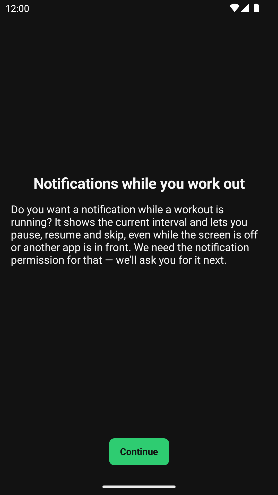
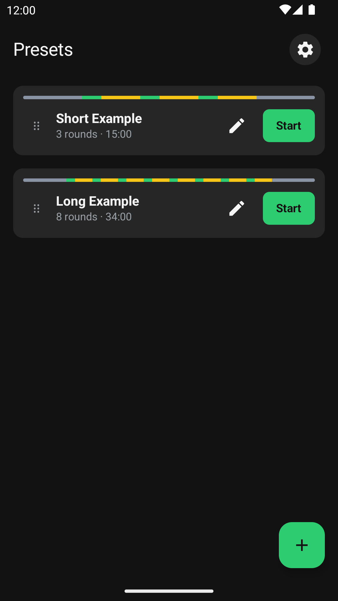
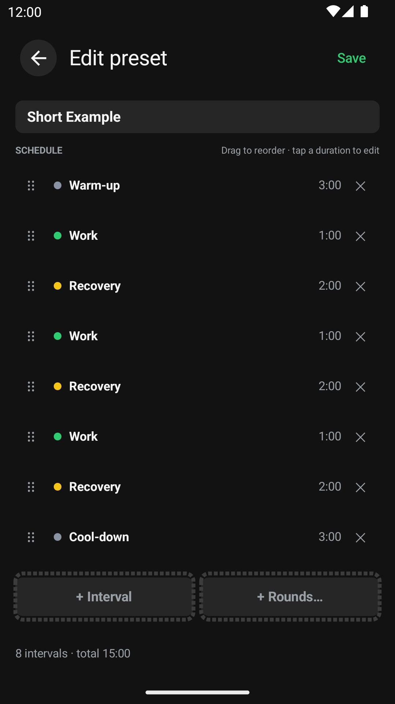
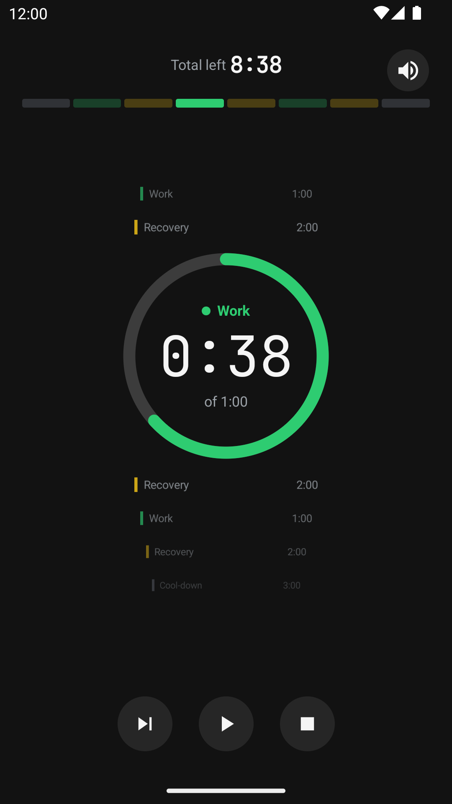
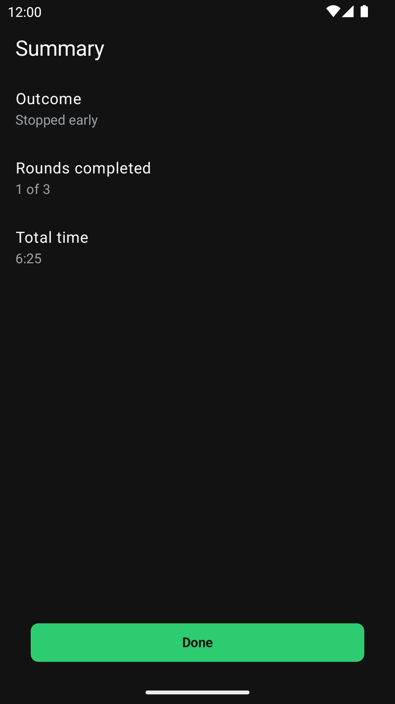
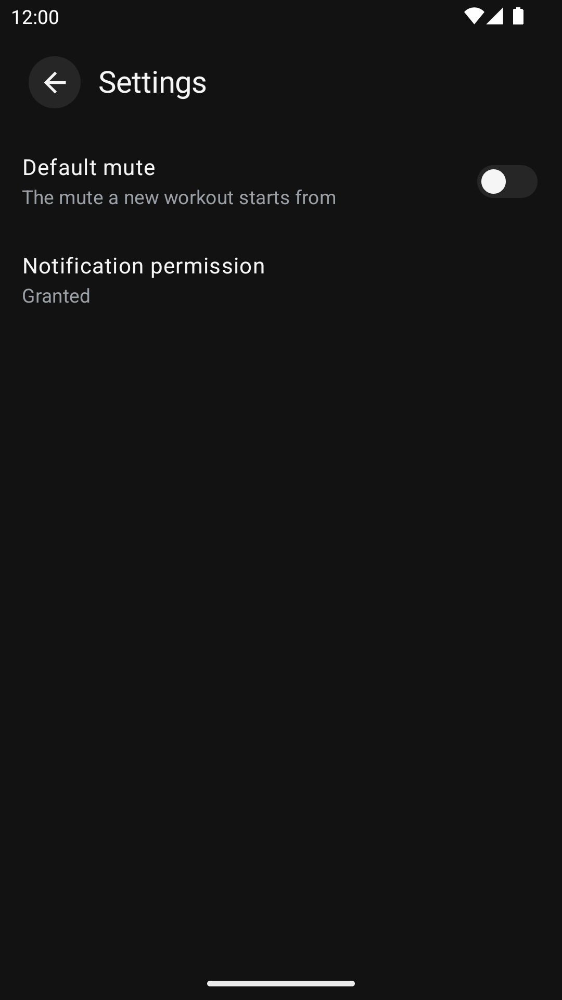

# Interval-trainer-android
Android app for interval exercises

## Screenshots

| First run | Home | Preset editor |
| --- | --- | --- |
|  |  |  |

| Running, paused | Summary | Settings |
| --- | --- | --- |
|  |  |  |

These are captured from the real debug build on an Android emulator by
[`screenshots.yml`](.github/workflows/screenshots.yml), and kept current by the
`docs: update screenshots` pull request it opens when a screen changes
([`docs/spec/build.md`](docs/spec/build.md) §11).

## Building

`./gradlew test` runs the unit tests; `./gradlew assembleDebug` builds the debug APK. Nothing but a
JDK 17 needs to be installed — the Gradle wrapper and the Android Gradle Plugin fetch the rest. What
the build guarantees is specified in [`docs/spec/build.md`](docs/spec/build.md).

## How work is run here

This repository has adopted [ai-sdlc](https://github.com/derekwinters/ai-sdlc), which runs its
issues, labels, triage, pull-request gates and releases. What is installed, and at which version,
is in [`.ai-sdlc/adoption.md`](.ai-sdlc/adoption.md); the repository-specific rules for working
here are in [`CLAUDE.md`](CLAUDE.md).
